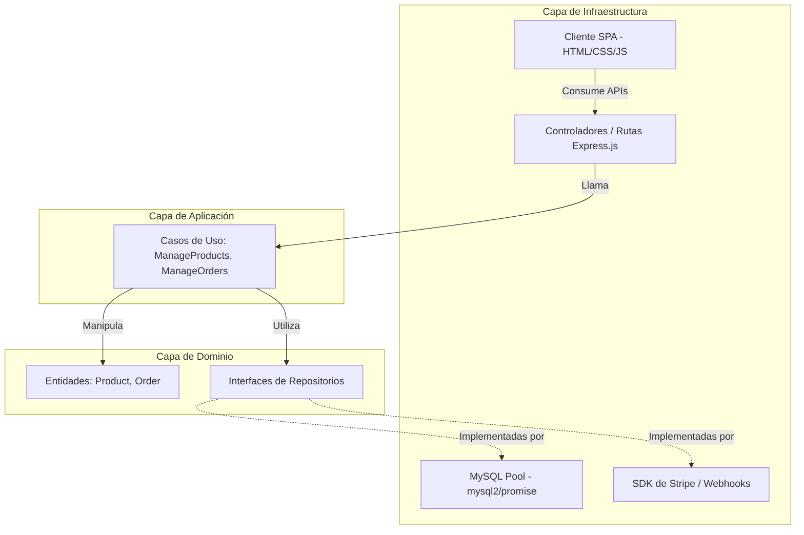
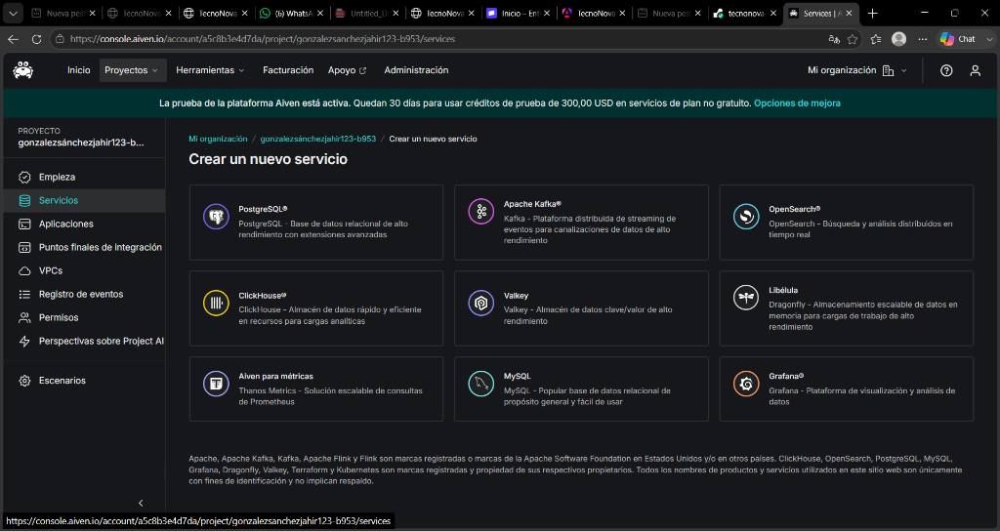
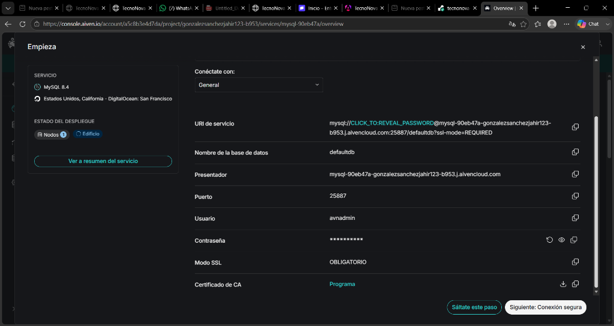
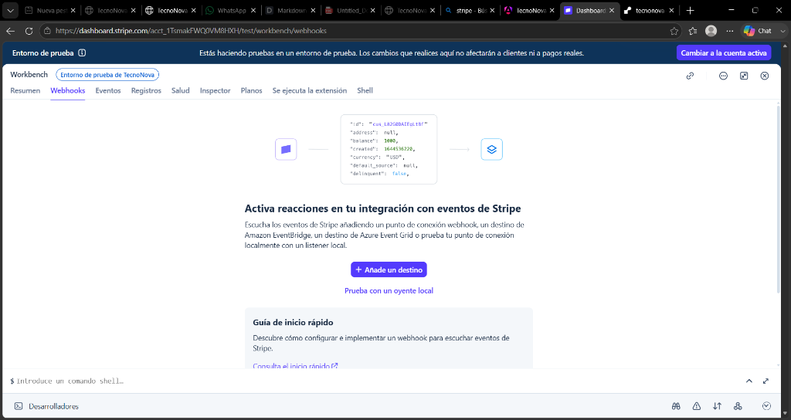
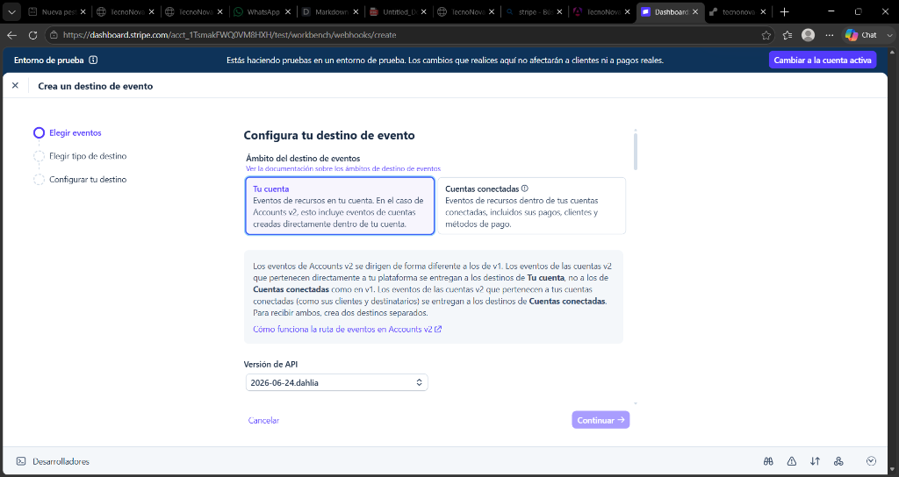
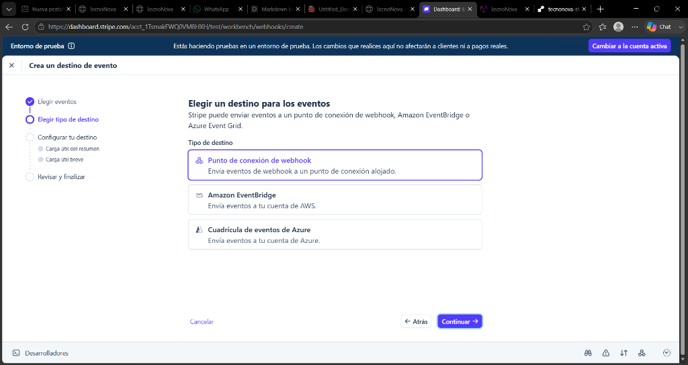
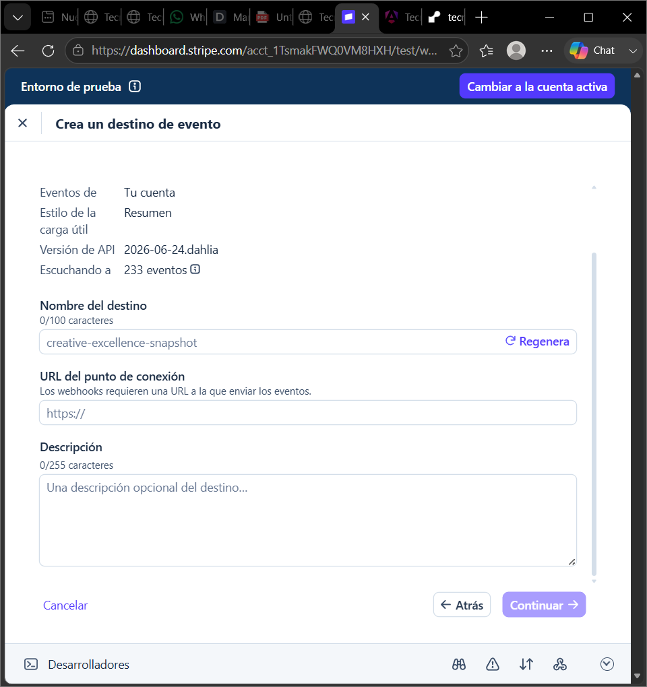
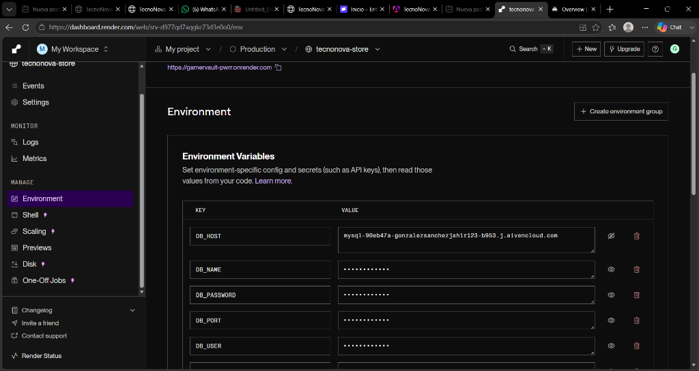
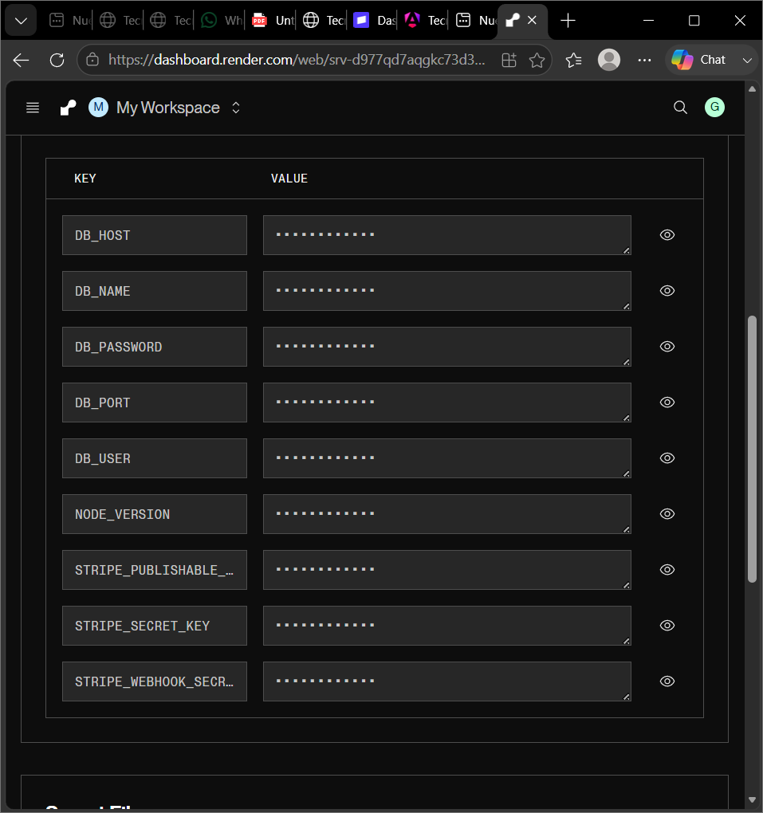

# DOCUMENTACIÓN TÉCNICA FORMAL DEL PROYECTO: TECNONOVA
**Sistema de Comercio Electrónico con Arquitectura Limpia, Persistencia en MySQL y Pasarela de Pagos Stripe**

---

## 1. INTRODUCCIÓN Y ALCANCE DEL PROYECTO

### 1.1. Descripción General
**TecnoNova** es una plataforma web de comercio electrónico (E-Commerce) de alto rendimiento especializada en la comercialización de componentes de hardware y computación de gama alta. El sistema se ha diseñado bajo los más altos estándares de ingeniería de software, implementando **Arquitectura Limpia (Clean Architecture)** y **Diseño Guiado por el Dominio (DDD)** para garantizar la escalabilidad, la mantenibilidad y el desacoplamiento de las reglas de negocio respecto de la infraestructura.

### 1.2. Objetivos del Sistema
* Proporcionar una interfaz de usuario fluida, reactiva y moderna (SPA) con un diseño visual de estilo oscuro y translúcido (*Glassmorphism*).
* Administrar de manera eficiente el catálogo de productos y el stock físico de forma transaccional.
* Registrar de forma persistente y cronológica el historial de transacciones en un servidor de base de datos **MySQL** en la nube.

---

## 2. ARQUITECTURA DEL SISTEMA Y DISEÑO DE SOFTWARE

El núcleo del software está estructurado bajo **Clean Architecture**, dividiendo el código en tres capas fundamentales que aíslan las reglas de negocio de los detalles técnicos.



### 2.1. Capa de Dominio (Domain)
Ubicada en `src/domain`, contiene las entidades principales del negocio (`Product`, `Order`) y las definiciones abstractas (interfaces) de cómo interactuar con ellos (`ProductRepository`, `OrderRepository`).

### 2.2. Capa de Aplicación (Application)
Ubicada en `src/application`, gestiona el flujo de información implementando casos de uso concretos como crear pedidos (`ManageOrders`) y añadir/eliminar productos del inventario (`ManageProducts`).

### 2.3. Capa de Infraestructura (Infrastructure)
Ubicada en `src/infrastructure`, contiene las implementaciones técnicas reales:
* **Base de Datos**: Clases `MysqlProductRepository` y `MysqlOrderRepository` que realizan consultas SQL asíncronas utilizando un Pool de conexiones a MySQL.
* **API y Enrutado**: Controladores de enrutamiento de Express (`productRoutes`, `orderRoutes`, `paymentRoutes`).
* **Front-End**: Archivos estáticos en la carpeta `public` (HTML, CSS y JS reactivo).

---

## 3. MODELO DE BASE DE DATOS (ESQUEMA FÍSICO MYSQL)

La persistencia de datos se gestiona en un servidor **MySQL** relacional con tres tablas estructuradas de forma óptima:

```sql
-- 1. Tabla de Productos
CREATE TABLE products (
    id VARCHAR(50) PRIMARY KEY,
    name VARCHAR(255) NOT NULL,
    description TEXT,
    price DECIMAL(10, 2) NOT NULL,
    stock INT NOT NULL
);

-- 2. Tabla de Órdenes (Cabecera)
CREATE TABLE orders (
    id VARCHAR(50) PRIMARY KEY,
    total DECIMAL(10, 2) NOT NULL,
    status VARCHAR(50) NOT NULL,
    created_at VARCHAR(50) NOT NULL
);

-- 3. Tabla de Ítems de la Orden (Detalle)
CREATE TABLE order_items (
    id INT AUTO_INCREMENT PRIMARY KEY,
    order_id VARCHAR(50) NOT NULL,
    product_id VARCHAR(50) NOT NULL,
    name VARCHAR(255) NOT NULL,
    price DECIMAL(10, 2) NOT NULL,
    quantity INT NOT NULL,
    FOREIGN KEY (order_id) REFERENCES orders(id) ON DELETE CASCADE
);
```

---

## 4. HISTORIAS DE USUARIO (METODOLOGÍA SCRUM)

---

### **Historia de Usuario 1: Catálogo Reactivo de Productos**
* **ID**: US-01
* **Título**: Consulta de inventario en tiempo real.
* **Descripción**: 
  > **Como** usuario del portal,  
  > **Quiero** ver un listado dinámico de los componentes con sus precios en Pesos Mexicanos (MXN) e indicador de stock,  
  > **Para** evaluar y seleccionar los artículos que deseo comprar.
* **Criterios de Aceptación**:
  * Consumir asíncronamente el endpoint `GET /api/products` para renderizar las tarjetas de productos.
  * Los precios deben formatearse usando la localización `es-MX` (ej: `$35,000.00 MXN`).
  * Si el stock de un producto es `0`, el botón debe deshabilitarse y mostrar el texto "Agotado".
* **Estimación**: 3 Story Points

---

### **Historia de Usuario 2: Gestión Integral del Carrito de Compras**
* **ID**: US-02
* **Título**: Gestión dinámica del carrito de compras.
* **Descripción**: 
  > **Como** comprador,  
  > **Quiero** añadir, modificar cantidades o eliminar productos de mi carrito en una barra deslizable con un botón directo,  
  > **Para** organizar mi pedido de forma rápida antes de pagar.
* **Criterios de Aceptación**:
  * Añadir productos al carrito controlando que la cantidad no supere el stock disponible del producto.
  * Habilitar botones `+` y `-` para ajustar las unidades de forma reactiva.
  * Añadir un botón `×` (eliminar) para remover el producto por completo de un solo clic.
  * Persistir el estado del carrito de forma local en el navegador (`localStorage`).
* **Estimación**: 5 Story Points

---

### **Historia de Usuario 3: Redirección Segura a Stripe Checkout**
* **ID**: US-03
* **Título**: Procesamiento de pagos seguro con Stripe.
* **Descripción**: 
  > **Como** cliente listo para comprar,  
  > **Quiero** que al confirmar la compra la tienda me redirija a una pasarela externa de Stripe en Pesos Mexicanos,  
  > **Para** realizar el pago de forma segura sin exponer mis datos bancarios.
* **Criterios de Aceptación**:
  * El botón "Confirmar Compra" debe solicitar una sesión en `/api/payments/create-checkout-session`.
  * El total del carrito debe superar el límite mínimo de Stripe ($10.00 MXN).
  * Redirigir la ventana a la URL segura provista por Stripe (`window.location.href = session.url`).
  * Validar precios desde la base de datos para evitar la manipulación de precios desde el cliente.
* **Estimación**: 8 Story Points

---

### **Historia de Usuario 4: Confirmación y Webhook de Stripe**
* **ID**: US-04
* **Título**: Registro automático de órdenes pagadas por Webhook.
* **Descripción**: 
  > **Como** administrador de TecnoNova,  
  > **Quiero** que el sistema reciba notificaciones criptográficas automáticas de Stripe al procesarse un pago,  
  > **Para** registrar la orden en MySQL y restar las unidades del stock automáticamente.
* **Criterios de Aceptación**:
  * Implementar el endpoint `POST /api/payments/webhook` que procesa los eventos firmados de Stripe.
  * Validar la firma criptográfica con la clave `STRIPE_WEBHOOK_SECRET`.
  * Al recibir el evento `checkout.session.completed`, procesar los metadatos de la compra, descontar el stock del producto e insertar la orden en MySQL con estado `PAID`.
* **Estimación**: 8 Story Points

---

### **Historia de Usuario 5: Registro e Historial de Órdenes**
* **ID**: US-05
* **Título**: Consulta del historial de compras.
* **Descripción**: 
  > **Como** cliente,  
  > **Quiero** ver un listado cronológico de las compras que he completado exitosamente,  
  > **Para** confirmar la transacción y revisar mis compras anteriores.
* **Criterios de Aceptación**:
  * Consumir el endpoint `GET /api/orders` y renderizar tarjetas con los datos de las compras.
  * Mostrar el ID recortado de la orden, la fecha formateada en formato local de México y el desglose de los productos adquiridos.
* **Estimación**: 3 Story Points

---

### **Historia de Usuario 6: Administración del Inventario**
* **ID**: US-06
* **Título**: Administración del catálogo (Agregar/Eliminar).
* **Descripción**: 
  > **Como** administrador,  
  > **Quiero** poder añadir nuevos componentes y eliminar productos obsoletos,  
  > **Para** mantener el catálogo de hardware actualizado.
* **Criterios de Aceptación**:
  * Formulario con validación en cliente/servidor para evitar IDs duplicados.
  * Tabla con el listado del inventario y botones rojos para "Eliminar" registros mediante la API `DELETE /api/products/:id`.
* **Estimación**: 5 Story Points

---

## 5. GUÍA PASO A PASO PARA EL DESPLIEGUE Y CONFIGURACIÓN (CON CAPTURAS)

Sigue estos pasos detallados para montar el servidor de forma local o en la nube.

---

### Paso 1: Configurar tu Base de Datos MySQL en la Nube (Aiven.io)
1. Regístrate o inicia sesión de forma gratuita en **[Aiven.io](https://console.aiven.io)**.
2. Crea un nuevo servicio seleccionando **MySQL**:
   
   
   
3. Elige el plan **Free** (Gratis), selecciona la región y haz clic en **Create service**. Espera 3 minutos a que el estado cambie a **Running** (Verde).
4. En la sección **Connection Info**, copia tus credenciales:
   
   
   
   * **Host**: (Ejemplo: `mysql-90eb47a-gonzalezsanchezjahir123-b953.j.aivencloud.com`)
   * **Port**: `25887`
   * **User**: `avnadmin`
   * **Password**: (La contraseña que obtienes al presionar el ojo 👁️ para revelarla).

---

### Paso 2: Configurar tu Cuenta de Stripe
1. Regístrate o ingresa gratis a **[Stripe.com](https://dashboard.stripe.com)**.
2. Activa el **Modo de prueba** (Test mode) en la esquina superior derecha.
3. Ve a **Developers > API Keys** para copiar tus llaves de prueba pública y secreta.
4. Ve a **Developers > Webhooks** para configurar un destino de evento de webhook:
   
   
   
5. Configura los parámetros en el asistente interactivo:
   * **Elige eventos**: Selecciona **`checkout.session.completed`**:
     
     
     
   * **Elige tipo de destino**: Selecciona **"Punto de conexión de webhook"**:
     
     
     
   * **Configurar tu destino**: Escribe tu URL pública de Render seguida de `/api/payments/webhook`:
     
     
     
6. Guarda y haz clic en **Revelar** en la clave de firma (*Signing secret*) para copiar el código **`whsec_...`**.

---

### Paso 3: Configurar el archivo `.env` en tu computadora local
Crea o edita el archivo **`.env`** en la carpeta raíz del proyecto con la siguiente estructura:

```env
PORT=3000

# Base de datos local (para tus pruebas locales) o la de Aiven
DB_HOST=localhost
DB_PORT=3306
DB_USER=root
DB_PASSWORD=TU_CONTRASEÑA_LOCAL_DE_MYSQL
DB_NAME=tecnonova

# Claves de Stripe
STRIPE_SECRET_KEY=sk_test_...
STRIPE_PUBLISHABLE_KEY=pk_test_...
STRIPE_WEBHOOK_SECRET=whsec_...
```

---

### Paso 4: Despliegue en la Nube (Render.com)
1. Inicia sesión en **[Render.com](https://dashboard.render.com)**.
2. Conecta tu repositorio de GitHub `dhhejej/tienda-api` y crea un nuevo **Web Service**.
3. En la sección **Environment** del servicio, añade las variables de entorno para conectar la base de datos MySQL y la pasarela Stripe sin salto de línea al final:
   
   
   
4. Al guardar, las variables se guardarán de forma segura y encriptada:
   
   
   
5. Haz clic en **Save, rebuild, and deploy**. ¡El sitio compilará y estará Live en Internet de forma permanente conectado a MySQL y cobrando en MXN con Stripe!
